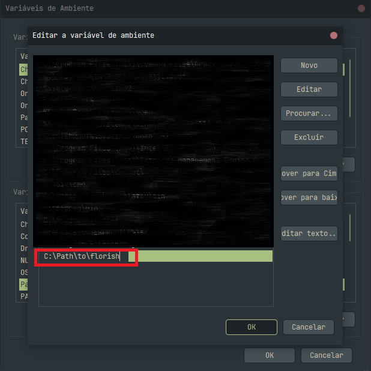
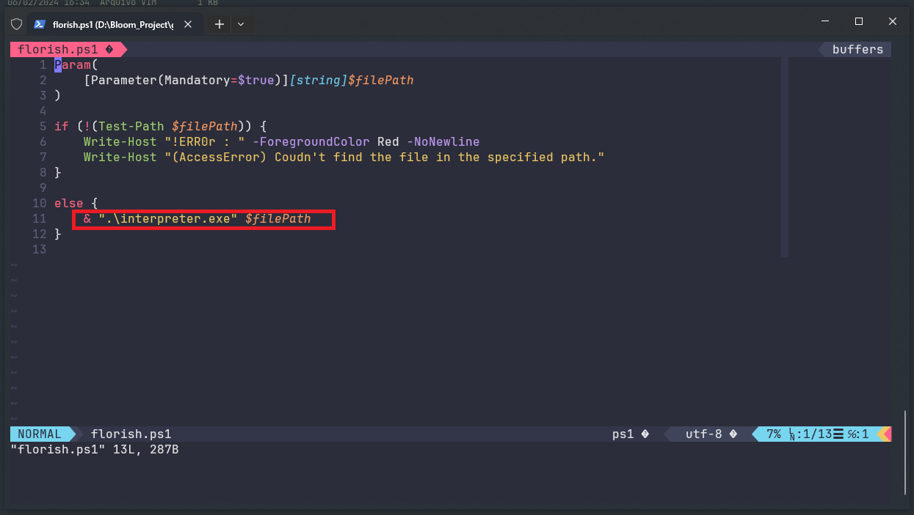
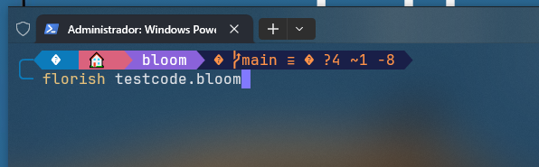

# 🌸 Repositório da Linguagem de Programação BLOOM 🌸

Bem-vindo ao repositório oficial da linguagem de programação Bloom! Este é um projeto pessoal no qual estou trabalhando com muita paixão. Sinta-se à vontade para explorar, experimentar e compartilhar seu feedback! Sua opinião é muito valorizada.

## Escolha o Idioma 🌐
- [Read-me em English](./README.md)
- [Read-me em Português](./README.PT-BR.md)
- [Read-me em Español](./README.ES.md)

## ⚙️ **Como Configurar:**

### 📥 Clonar o Repositório

Primeiro, clone o repositório usando git:

```bash
git clone https://github.com/Nauzoo/bloom
```

### 🖥️ Instruções para Windows:

1. **Criar um Arquivo Executável**

   Execute o seguinte comando para criar um arquivo executável:

   ```bash
   pyinstaller --noconfirm --onedir --console --icon "./assets/bloom_ico.ico" --name "BLOOM" --log-level "DEBUG"  "./source/interpreter.py"
   ```

   > Nota: Você precisa do [PyInstaller](https://pyinstaller.org/en/stable/) para executar este comando.

2. **Adicionar às Variáveis de Ambiente**

   Adicione a pasta que contém `florish.ps1` às suas variáveis de ambiente:

   

3. **Modificar o Caminho em `florish.ps1`**

   Certifique-se de que o caminho para o executável do interpretador esteja corretamente definido em `florish.ps1`:

   

4. **Executar o Interpretador**

   Agora você pode executar o interpretador com:

   ```bash
   florish caminho_para_o_arquivo.bloom
   ```

   

   Este repositório inclui alguns códigos de exemplo para você testar!

---

Aproveite a programação com Bloom! Se você encontrar algum problema ou tiver sugestões, não hesite em abrir uma issue ou pull request. Feliz codificação! 🌼