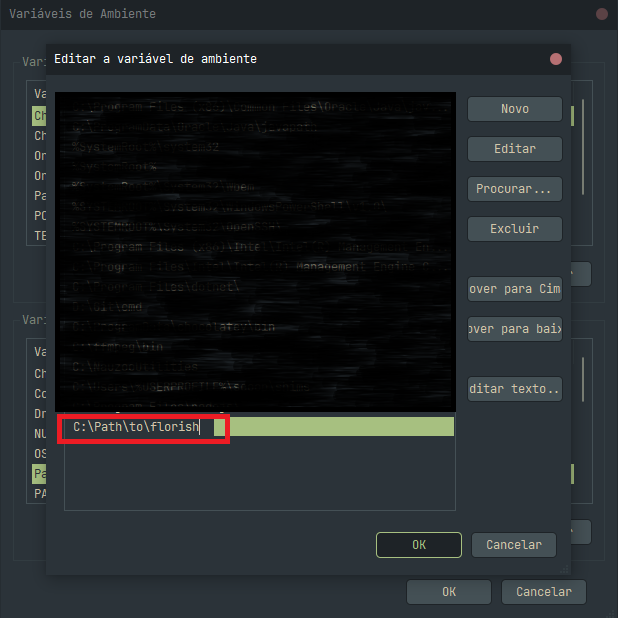
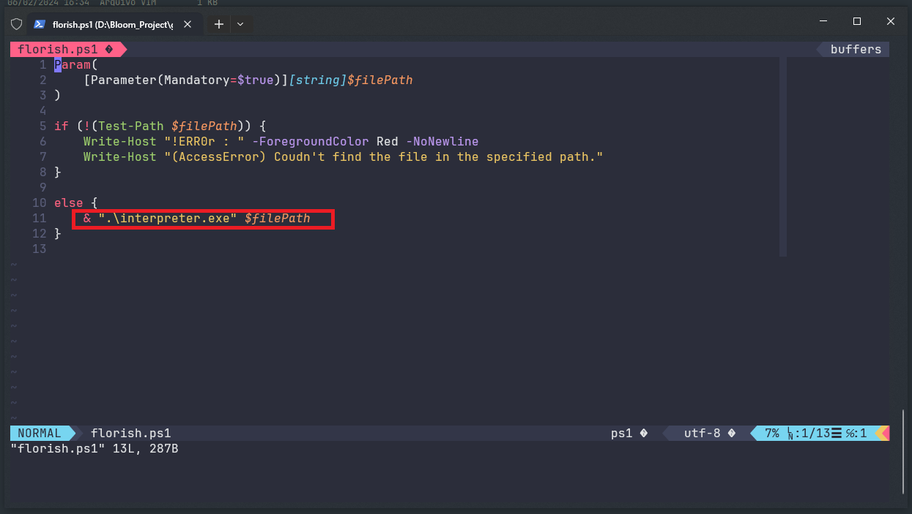

# 🌸 BLOOM Programming Language Repository 🌸

Welcome to the official repository for the Bloom programming language! This is a personal project that I'm passionately working on. Feel free to explore, try it out, and share your feedback! Your input is greatly appreciated.

## Choose Language 🌐
- [Read-me in English](./README.md)
- [Read-me in Português](./README.PT-BR.md)
- [Read-me in Español](./README.ES.md)

## **How to Set Up:**

### 📥 Clone the Repository

First, clone the repository using git:

```bash
git clone https://github.com/Nauzoo/bloom
```

### 🖥️ Instructions for Windows:

1. **Create an Executable File**

   Run the following command to create an executable file:

   ```bash
   pyinstaller --noconfirm --onedir --console --icon "./assets/bloom_ico.ico" --name "BLOOM" --log-level "DEBUG"  "./source/interpreter.py"
   ```

   > Note: You need [PyInstaller](https://pyinstaller.org/en/stable/) to run this command.

2. **Add to Environment Variables**

   Add the folder containing `florish.ps1` to your environment variables:

   

3. **Modify the Path in `florish.ps1`**

   Ensure the path to your interpreter executable is correctly set in `florish.ps1`:

   

4. **Run the Interpreter**

   You can now run the interpreter with:

   ```bash
   florish path_to_file.bloom
   ```

   

   This repository includes some example code for you to test out!

---

Enjoy coding with Bloom! If you encounter any issues or have suggestions, don't hesitate to open an issue or pull request. Happy coding! 🌼